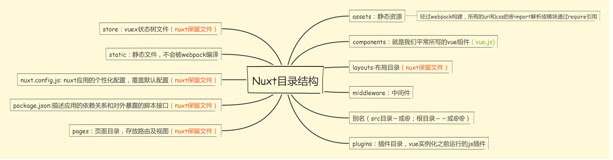
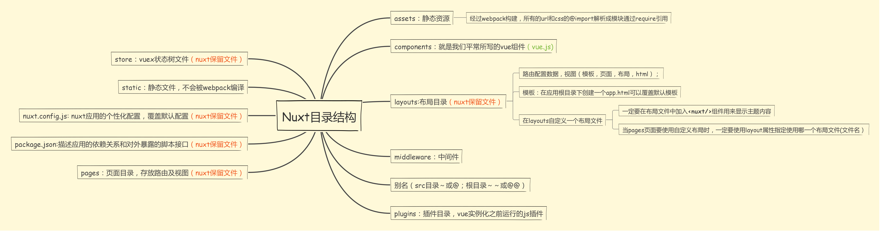
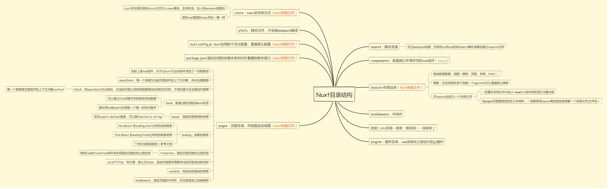
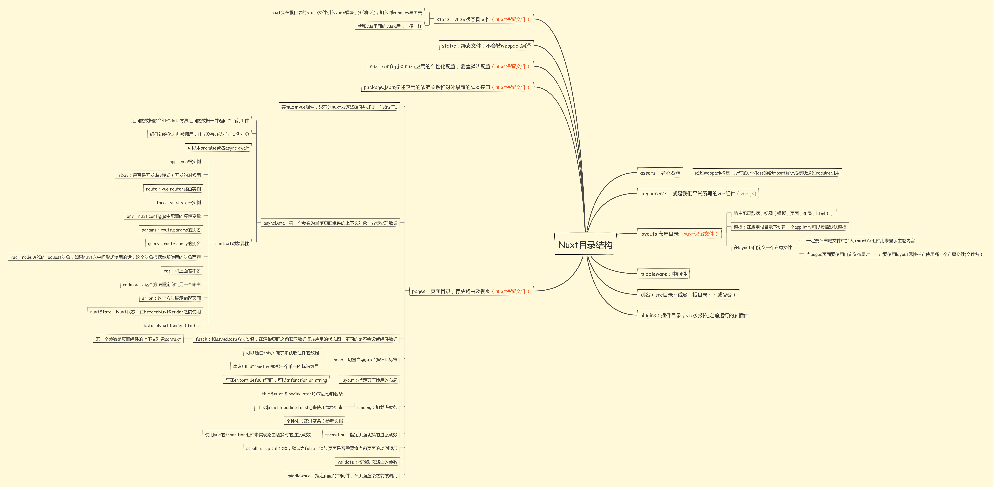

# 初探 `SSR` 之 `Nuxt`
曾今听说过 `SSR` 做搜索引擎优化（ `SEO` )，那时候的我只知道有这个东西并不了解。现在因为工作需要入门学习了 `Nuxt` ，刚刚开始我还以为很难，学完之后发现他比我
想象中的简单多了。粗略看一遍文档，敲一遍文档的案例，在再网上找了一个小小的项目练练手。好像就已经学的差不多了，但愿等工作需要的时候我可以快速上手，用着毫无压力吧。

在学习过程中参考的资料有：文档 [`Nuxt.js`](https://zh.nuxtjs.org/guide) 和 [合格前端系列第十一弹-初探 Nuxt.js 秘密花园](https://my.oschina.net/qiangdada/blog/1789641)里面的 `Demo` 小项目。阅读文档不仔细，闹过一次笑话。

## `Nuxt` 目录结构

创建一个 `nuxt` 很简单，我假设你已经不是刚刚入门前端的小伙伴了
```
$ npx create-nuxt-app <项目名>
```
创建好项目以后，会得到入流程图所示的项目结构



初始化得到的这个项目目录结构基本不需要我们在做什么改变，我们只要在对应的目录底下做编写对应的代码就好了。
`nuxt` 搭建的项目和用 `vue cli` 搭建的项目有些不一样的事，不需要我们手动去设置路由。所有的路由都是 `nuxt` 帮我们设置好的。
优点就是，再也不用担心我绞破脑汁想路由名字了；下面会详细介绍，没有介绍到的目录或者文件，都在流程图里面详细介绍了，大部分的配置和
 `vue cli` 配置大同小异 。

## 页面布局



关于页面要如何进行布局，我们通常把它放在 `layouts` 目录底下 `default.vue` 文件里面（默认布局）
例如 `default.vue` 代码如图所示

```
<template>
  <div>
    <v-header></v-header>
    <main ref="container" class="content-container">
      <nuxt />
    </main>
  </div>
</template>
```
那么所有页面都将引入一个 `v-header` 组件，所有 `pages` 目录底下页面代码都将放入到 `main` 标签里面（前提是你没有使用自定义布局）
关于自定义布局请转接到[文档](https://zh.nuxtjs.org/guide/views)

## 页面
`Nuxt.js` 为页面提供的特殊配置项，我们在页面中可以直接这些方法和属性



在 `asyncData` 方法里面第一个参数就是当前页面组件的上下文的对象



因为其他方法里面也有上下文这个东西详细介绍一下，关于其他方法和属性详细信息请参考 [api](https://zh.nuxtjs.org/api/)
### 路由信息
#### 基本路由
假设 `pages` 的目录结构如下：
```
pages/
--| user/
-----| index.vue
-----| one.vue
--| index.vue
```

那么，`Nuxt.js` 自动生成的路由配置如下：

```
router: {
  routes: [
    {
      name: 'index',
      path: '/',
      component: 'pages/index.vue'
    },
    {
      name: 'user',
      path: '/user',
      component: 'pages/user/index.vue'
    },
    {
      name: 'user-one',
      path: '/user/one',
      component: 'pages/user/one.vue'
    }
  ]
}

```
#### 动态路由

带参数的动态路由，需要创建对应的以下划线作为前缀的 `Vue` 文件 或 目录。

假设 `pages` 的目录结构如下：

```
pages/
--| _slug/
-----| comments.vue
-----| index.vue
--| users/
-----| _id.vue
--| index.vue
```

`Nuxt.js` 生成对应的路由配置表为：

```
router: {
  routes: [
    {
      name: 'index',
      path: '/',
      component: 'pages/index.vue'
    },
    {
      name: 'users-id',
      path: '/users/:id?',
      component: 'pages/users/_id.vue'
    },
    {
      name: 'slug',
      path: '/:slug',
      component: 'pages/_slug/index.vue'
    },
    {
      name: 'slug-comments',
      path: '/:slug/comments',
      component: 'pages/_slug/comments.vue'
    }
  ]
}
```
你会发现名称为 `users-id` 的路由路径带有 `:id?` 参数，表示该路由是可选的。如果你想将它设置为必选的路由，需要在 `users/_id` 目录内创建一个 `index.vue` 文件。

更多路由信息请参考[参考文档](https://zh.nuxtjs.org/guide/routing)

## `Nuxt api`

 
 
 最重要的是我们要了解他的生命周期，这样才可以更好的使用他
 
 

## 进入`DEMO`
真枪实弹做一次，体会更加深刻，不能纸上谈兵。
负责搬砖我的，搬了一个仿掘金的  `Demo` 项目，项目完全参考[合格前端系列第十一弹-初探 Nuxt.js 秘密花园](https://my.oschina.net/qiangdada/blog/1789641)
